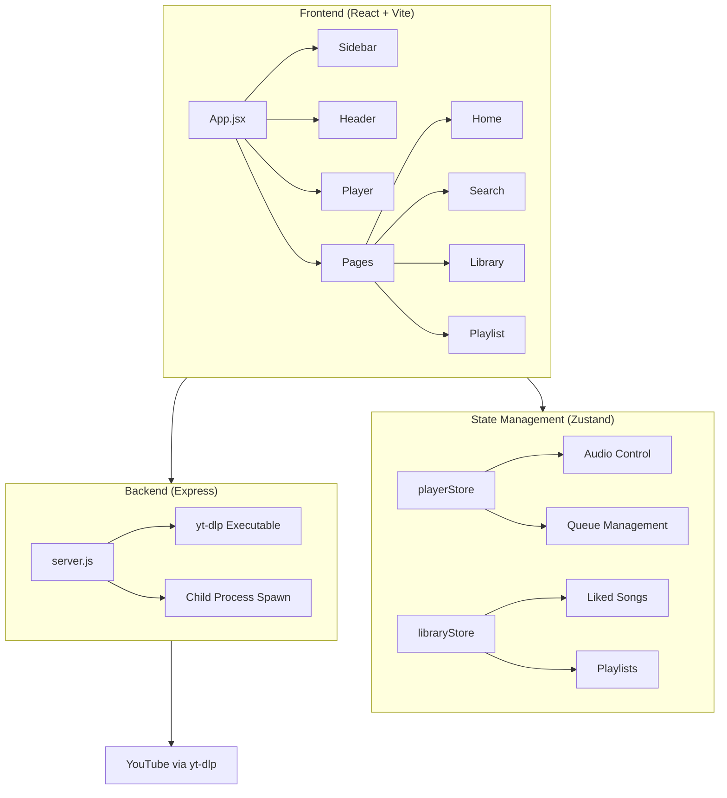

# GE'EZ music - Walkthrough

A modern, premium web-based music streaming application inspired by [Spotube](https://github.com/KRTirtho/spotube).

## What Was Built

### Architecture Overview



---

## Files Created

### Project Root
| File | Description |
|------|-------------|
| [package.json](file:///c:/Users/mikis/OneDrive/Documents/music%2022/package.json) | Project dependencies and scripts |
| [vite.config.js](file:///c:/Users/mikis/OneDrive/Documents/music%2022/vite.config.js) | Vite configuration with React plugin |
| [index.html](file:///c:/Users/mikis/OneDrive/Documents/music%2022/index.html) | HTML entry point |

---

### Source Code (`src/`)

#### Core Files
| File | Description |
|------|-------------|
| [main.jsx](file:///c:/Users/mikis/OneDrive/Documents/music%2022/src/main.jsx) | React entry point |
| [App.jsx](file:///c:/Users/mikis/OneDrive/Documents/music%2022/src/App.jsx) | Main app with routing |
| [index.css](file:///c:/Users/mikis/OneDrive/Documents/music%2022/src/index.css) | Design system |

#### State Stores
| File | Description |
|------|-------------|
| [playerStore.js](file:///c:/Users/mikis/OneDrive/Documents/music%2022/src/store/playerStore.js) | Audio playback state |
| [libraryStore.js](file:///c:/Users/mikis/OneDrive/Documents/music%2022/src/store/libraryStore.js) | Library & playlists |

#### API Services
| File | Description |
|------|-------------|
| [musicApi.js](file:///c:/Users/mikis/OneDrive/Documents/music%2022/src/services/musicApi.js) | Music search & streaming |
| [lyricsApi.js](file:///c:/Users/mikis/OneDrive/Documents/music%2022/src/services/lyricsApi.js) | Synced lyrics from LRCLib |

#### Components
| Component | Files |
|-----------|-------|
| Sidebar | [Sidebar.jsx](file:///c:/Users/mikis/OneDrive/Documents/music%2022/src/components/Sidebar/Sidebar.jsx), [Sidebar.css](file:///c:/Users/mikis/OneDrive/Documents/music%2022/src/components/Sidebar/Sidebar.css) |
| Header | [Header.jsx](file:///c:/Users/mikis/OneDrive/Documents/music%2022/src/components/Header/Header.jsx), [Header.css](file:///c:/Users/mikis/OneDrive/Documents/music%2022/src/components/Header/Header.css) |
| Player | [Player.jsx](file:///c:/Users/mikis/OneDrive/Documents/music%2022/src/components/Player/Player.jsx), [Player.css](file:///c:/Users/mikis/OneDrive/Documents/music%2022/src/components/Player/Player.css) |
| TrackList | [TrackList.jsx](file:///c:/Users/mikis/OneDrive/Documents/music%2022/src/components/TrackList/TrackList.jsx), [TrackList.css](file:///c:/Users/mikis/OneDrive/Documents/music%2022/src/components/TrackList/TrackList.css) |
| LyricsOverlay | [LyricsOverlay.jsx](file:///c:/Users/mikis/OneDrive/Documents/music%2022/src/components/LyricsOverlay/LyricsOverlay.jsx), [LyricsOverlay.css](file:///c:/Users/mikis/OneDrive/Documents/music%2022/src/components/LyricsOverlay/LyricsOverlay.css) |

#### Pages
| Page | File |
|------|------|
| Home | [Home.jsx](file:///c:/Users/mikis/OneDrive/Documents/music%2022/src/pages/Home.jsx) |
| Search | [Search.jsx](file:///c:/Users/mikis/OneDrive/Documents/music%2022/src/pages/Search.jsx) |
| Library | [Library.jsx](file:///c:/Users/mikis/OneDrive/Documents/music%2022/src/pages/Library.jsx) |
| Playlist | [Playlist.jsx](file:///c:/Users/mikis/OneDrive/Documents/music%2022/src/pages/Playlist.jsx) |

---

### Backend Server (`server/`)
| File | Description |
|------|-------------|
| [server.js](file:///c:/Users/mikis/OneDrive/Documents/music%2022/server/server.js) | Express proxy for Piped API |
| [package.json](file:///c:/Users/mikis/OneDrive/Documents/music%2022/server/package.json) | Server dependencies |

---

## Features Implemented

### 🎵 Music Playback
- Search for any song using YouTube Music as backend
- High-quality audio streaming via Piped API
- Play/pause, next/previous controls
- Progress bar with seeking
- Volume control with mute toggle
- **Server-side caching for instant search & playback**

### 📝 Synced Lyrics
- Fetches lyrics from LRCLib API
- Auto-scrolling synced lyrics display
- Full-screen lyrics overlay with blurred background

### 💾 Local Library
- Like songs (persisted in localStorage)
- Create custom playlists
- Recently played tracking
- All data persists across sessions

### 🎨 Premium UI
- Dark theme with glassmorphism effects
- Gradient accents and smooth animations
- Fully responsive (desktop, tablet, mobile)
- Spotify-inspired design

### 🔀 Playback Modes
- Shuffle mode
- Repeat modes (off, all, one)
- Queue management

### 🚀 Pro Features
- **Download Manager**: Download tracks as MP3s for offline listening
- **Keyboard Shortcuts**: Control playback with Space, Arrows, M, L, S, R
- **PWA Support**: Installable as a native app on desktop and mobile

---

## How to Run

### Start Backend Server
```bash
cd server
node server.js
```
Server runs on `http://localhost:3001`

### Start Frontend
```bash
npm run dev
```
App runs on `http://localhost:5173`

---

## Usage

1. **Search**: Type a song name in the search bar
2. **Browse**: Click genre cards to discover music
3. **Play**: Double-click any track or click the play button
4. **Like**: Click the heart icon on any track
5. **Playlist**: Click "Create Playlist" in sidebar, then add songs from search results
6. **Lyrics**: Click the lyrics icon in the player
7. **Queue**: Use next/previous buttons or enable shuffle

---

## Tech Stack

| Layer | Technology |
|-------|------------|
| Frontend | React 18, Vite, React Router |
| State | Zustand with persistence |
| Styling | Vanilla CSS with custom properties |
| Backend | Express.js with CORS |
| APIs | yt-dlp (YouTube), LRCLib (Lyrics) |
